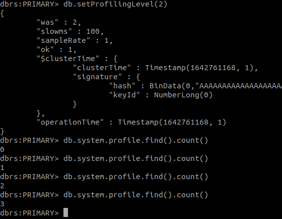

# MongoReadReplica

## Goal
  
Setup two MongoDB one for write queries (using disk)  
and another for read queries (using ram)

## Prerequisites

### docker-compose
[Install](https://docs.docker.com/compose/install/)

### MongoDB client
You can use extensions or install MongoDB client with this command:  
```apt install mongodb-clients```  
And then you can connect to MongoDB like this:  
```mongo --host "mongodb://localhost:27017"```  

## Create just one MongoDB using docker-compose

You can run a docker-compose with this command:  
```bash
docker-compose -f path/to/docker-compose.yml up
```

[docker-compose-init-db.yml](https://github.com/SmsS4/MongoReadReplica/blob/main/docker-compose-init-db.yml)
```yml
version: '3'

services:
  mongo:
    image: mongo
    volumes: 
      - ./data:/data/db
```
Mongodb stores database in `/data/db`

## Create two MongoDB
[docker-compose-read-and-write.yml](https://github.com/SmsS4/MongoReadReplica/blob/main/docker-compose-read-and-write.yml)
```yml
version: '3'

services:
  mongo-write:
    container_name: mongo-write
    image: mongo
    volumes: 
      - ./data-write:/data/db

  mongo-read:
    container_name: mongo-read
    image: mongo
    volumes: 
      - ./data-read:/data/db
```  
Now we have two MongoDB one in a container  
named `mongo-write` and other in `mongo-read`

## Sync two MongoDB
To run commands in docker container you can use this command:  
```bash
docker exec -it mongo-read bash
```
(Or use mongo-write instead)


Look at [sync.sh](https://github.com/SmsS4/MongoReadReplica/blob/main/scripts/sync.sh):  
```bash
until mongo --host mongo-write:27017 --eval "print(\"waited for connection write\")"
do
    sleep 1
done

until mongo --host mongo-read:27017 --eval "print(\"waited for connection read\")"
do
    sleep 1
done

echo "Adding replicas"

mongo --host mongo-write:27017 <<EOF
var config = {
    "_id": "dbrs",
    "version": 1,
    "members": [
        {
            "_id": 1,
            "host": "mongo-write:27017",
            "priority": 2
        },
        {
            "_id": 2,
            "host": "mongo-read:27017",
            "priority": 1
        }
    ]
};
rs.initiate(config, { force: true });
rs.reconfig(config, { force: true });
EOF
```

First you have to connect to one of containers  
first part of scripts waits for mongo-write
```bash
until mongo --host mongo-write:27017 --eval "print(\"waited for connection write\")"
do
    sleep 1
done
```
You can run commands in MongoDB cli using `--eval` flag  
so this 5 lines wait for `mongo-write` to be responsive.  
and next 5 lines wait for `mongo-read`.  

```bash
mongo --host mongo-write:27017 <<EOF
var config = {
    "_id": "dbrs",
    "version": 1,
    "members": [
        {
            "_id": 1,
            "host": "mongo-write:27017",
            "priority": 2
        },
        {
            "_id": 2,
            "host": "mongo-read:27017",
            "priority": 1
        }
    ]
};
rs.initiate(config, { force: true });
rs.reconfig(config, { force: true });
EOF
```
This part of script connects to `mongo-write`
(You can also connect to `mongo-read`)  
config["_id"] is name of ReplicaSet we used  
in `--replSet` flag in docker-compose([read more](https://docs.mongodb.com/manual/replication/))  
Our ReplicaSet consists from two replica.  
Replica with higher priority is for write.  
MongoDB supports only one replica for writing  
and you can olny read from other replicas.  
So  
```json
{
    "_id": 1,
    "host": "mongo-write:27017",
    "priority": 2
}
```
is for write and
```json
{
    "_id": 2,
    "host": "mongo-read:27017",
    "priority": 1
}
```
is for read. (because of lower pririty)  
And last part
```
rs.initiate(config, { force: true });
rs.reconfig(config, { force: true });
```
config MongoDBs to be ReplicaSet.

## Sync two MongoDB (automatic)
[docker-compose-sync-replica.yml](https://github.com/SmsS4/MongoReadReplica/blob/main/docker-compose-sync-replica.yml)
```yml
version: '3'

services:
  mongo-write:
    container_name: mongo-write
    image: mongo
    volumes: 
      - ./data-write:/data/db
      - ./scripts:/scripts
    links:
      - mongo-read
    command: bash -c "(./scripts/sync.sh&) ; mongod --bind_ip_all --replSet dbrs"
  
  mongo-read:
    container_name: mongo-read
    image: mongo
    volumes: 
      - ./data-read:/data/db
    entrypoint: [ "/usr/bin/mongod", "--bind_ip_all", "--replSet", "dbrs" ]
```
If you don't want to run `sync.sh` you can use  
command in docker-compose.  
You can run MongoDB server using
```
mongod --bind_ip_all
```  
but sync.sh needs MongoDB to be responsive so  
you can't first run `sync.sh` then MongoDB server  
like this:
```
./scripts/sync.sh && mongo --bind_ip_all
```
because `sync.sh` never finish.  
and you can't use this:  
```
mongo --bind_ip_all && ./scripts/sync.sh
```
because `mongo` is blocking. (To run a  
mongod process as a daemo, you can use  
`--fork` flag)  
So we run `sync.sh` in background using `&`

### another way to run sync.sh
You can also make another container to  
connect to `mongo-write` like this:
```
mongo-add-replica:
    image: mongo
    volumes: 
      - ./scripts:/scripts
    command: bash -c "./scripts/sync.sh"
```
This container runs `sync.sh` on start

### Test
```
docker-compose -f docker-compose-sync-replica.yml up
docker exec -it mongo-read bash
mongo
```
Now you are connected to MongoDB cli.  
you should see `SECONDARY` in cli like this:  
```
dbrs:SECONDARY> 
```
Now connect to `mongo-write`
```
docker exec -it mongo-read bash
mongo
```


you shoud see `PRIMARY` in cli like this:
```
dbrs:PRIMARY> 
```
write (using PRIMARY):
```
db.release_year.insertOne({ name: "Example", year: 2017})
```
output:
```
dbrs:PRIMARY> db.release_year.insertOne({ name: "Example", year: 2017})
{
	"acknowledged" : true,
	"insertedId" : ObjectId("61ea85c69aecfb00cf1d6e4a")
}
```
read (using SECONDARY):
```
db.release_year.find();
```
but you get error :)
```
dbrs:SECONDARY> db.release_year.find();
Error: error: {
	"topologyVersion" : {
		"processId" : ObjectId("61ea85479e109136b73bd908"),
		"counter" : NumberLong(3)
	},
	"ok" : 0,
	"errmsg" : "not master and slaveOk=false",
	"code" : 13435,
	"codeName" : "NotPrimaryNoSecondaryOk",
	"$clusterTime" : {
		"clusterTime" : Timestamp(1642759657, 1),
		"signature" : {
			"hash" : BinData(0,"AAAAAAAAAAAAAAAAAAAAAAAAAAA="),
			"keyId" : NumberLong(0)
		}
	},
	"operationTime" : Timestamp(1642759657, 1)
}
```
because of `NotPrimaryNoSecondaryOk`  
first you have to run `rs.slaveOk()`  
to allow secondary just for current session,
meaning if you reconnect to `mongo-read`  
you have to use `rs.slaveOk()` again:  
```
rs.slaveOk()
db.release_year.find();
```
output:
```
dbrs:SECONDARY> rs.slaveOk()
dbrs:SECONDARY> db.release_year.find();
{ "_id" : ObjectId("61ea85c69aecfb00cf1d6e4a"), "name" : "Example", "year" : 2017 }
```

## Use ram for mongo-read
Unfortunately MongoDB supports in-memory  
database just in enterprise version but  
you can create your volume in ram like this:
```yml
volumes:
    - type: tmpfs
    target: /data/db
```
[docker-compose-sync-replica-in-memory.yml](https://github.com/SmsS4/MongoReadReplica/blob/main/docker-compose-sync-replica-in-memory.yml)
```yml
version: '3'

services:
  mongo-write:
    container_name: mongo-write
    image: mongo
    volumes: 
      - ./data-write:/data/db
      - ./scripts:/scripts
    links:
      - mongo-read
    command: bash -c "(./scripts/sync.sh&) ; mongod --bind_ip_all --replSet dbrs"

  
  mongo-read:
    container_name: mongo-read
    image: mongo
    volumes:
      - type: tmpfs
        target: /data/db
    entrypoint: [ "/usr/bin/mongod", "--bind_ip_all", "--replSet", "dbrs" ]
```

## Expose ports
When MongoDB client connects to ReplicaSet  
ReplicaSet assume replicas are in  
`mongo-read:27017` and `mongo-write:27017`.  
and tells to your client to connect to these  
two url but if your client is not in docker network,  
your client should connects to `localhost:27017`  
and `localhost:27018` (if you expose ports on  
27017 and 27018)  
To fix this issue you can use `network_mode` ([read more](https://docs.docker.com/compose/networking/))  
another way is to add `mongo-read` and  
`mongo-write` to your hosts file. and run  
`mongo-read` on port 27018.  
you can edit hosts file like this:  
```bash
sudo vim /etc/hosts
```
and add 
```
127.0.0.1   mongo-write
127.0.0.1   mongo-read
```  
for example my `/etc/hosts` is like this:  
```
127.0.0.1	localhost
127.0.1.1	smss-256
127.0.0.1	mongo-write
127.0.0.1	mongo-read

# The following lines are desirable for IPv6 capable hosts
::1     ip6-localhost ip6-loopback
fe00::0 ip6-localnet
ff00::0 ip6-mcastprefix
ff02::1 ip6-allnodes
ff02::2 ip6-allrouters
```  
So now ReplicaSet instances are on  
`mongo-write:27017` and `mongo-read:27018`  
and you can connect to them from your client.  
and you have to edit `sync.sh` with new port. ([sync-final](https://github.com/SmsS4/MongoReadReplica/blob/main/scripts/sync-final.sh))

[docker-compose-final.yml](https://github.com/SmsS4/MongoReadReplica/blob/main/docker-compose-final.yml)
```yml
version: '3'

services:
  mongo-write:
    container_name: mongo-write
    image: mongo
    volumes: 
      - ./data-write:/data/db
      - ./scripts:/scripts
    links:
      - mongo-read
    ports:
      - 27017:27017
    command: bash -c "(./scripts/sync-final.sh&) ; mongod --bind_ip_all --replSet dbrs"

  
  mongo-read:
    container_name: mongo-read
    image: mongo
    volumes:
      - type: tmpfs
        target: /data/db
    ports:
      - 27018:27018
    entrypoint: [ "/usr/bin/mongod", "--bind_ip_all", "--replSet", "dbrs", "--port", "27018"]
```

Now you have two MongoDB one for read  
queries and another for write queries :)

## Connect to database using mongodb in NodeJS
Your cleint should connects to
```
mongodb://localhost:27017,localhost:27018?replicaSet=dbrs&readPreference=secondary
```
first part is your instances url
```
localhost:27017,localhost:27018
```
`replicaSet=dbrs` is name of ReplicaSet (config["_id"] in sync_final.sh)  
and you have to set `readPreference` to `secondary`  
so read queries use `mongo-read` (secondary)

you can connects to MongoDB ReplicaSet  
using mongodb package like this:
```js
import {MongoClient} from 'mongodb'

var url = "mongodb://localhost:27017,localhost:27018?replicaSet=dbrs&readPreference=secondary";
const COLLECTION_NAME = "cll"

MongoClient.connect(url, function(err, client) {
  if (err) throw err;
  console.log("Connected!");
});
```
[write.js](https://github.com/SmsS4/MongoReadReplica/blob/main/write.js) is example of writing to database

```js
import {MongoClient} from 'mongodb'

var url = "mongodb://localhost:27017,localhost:27018?replicaSet=dbrs&readPreference=secondary";
const COLLECTION_NAME = "cll"

MongoClient.connect(url, function(err, client) {
  if (err) throw err;
  console.log("Connected!");
  var db = client.db("mydb");

  db.createCollection(COLLECTION_NAME).then(
    (res) => {
      console.log("Collection created!");
      var myobj = { name: "Company Inc", address: "Highway 37" };
      var hisobj = { name: "Onja", address: "Inja" };
      return db.collection(COLLECTION_NAME).insertMany([myobj, hisobj])
    }
  ).then(
    (res) => {
      console.log("2 document inserted");
      return db.collection(COLLECTION_NAME).find({}).toArray()
    }
  ).then(
    (res) => {
      console.log(`Found ${res.length} documents`)
      console.log(res);
      return
    }
  )
  .then(() => {
    client.close()
    console.log("Done. closing connection")
  })
  .catch((error) => {
    console.log("Error\n", error)
    client.close()
  })
});
```
There is one read query in write.js.  
to read from database you can use [read.js](https://github.com/SmsS4/MongoReadReplica/blob/main/read.js)
```js
import {MongoClient} from 'mongodb'
var url = "mongodb://localhost:27017,localhost:27018?replicaSet=dbrs&readPreference=secondary";

const COLLECTION_NAME = "cll"

MongoClient.connect(
    url,
    // {readPreference: "secondary"},
    function(err, client){
      console.log("Hey")
      if (err) {
        console.log(err)
        client.close()
        throw err
      }
      var db = client.db("mydb");
      db.collection(COLLECTION_NAME).find({}
        ).toArray().then(
        (res) => {
          console.log(res)
          client.close()
        }
      ).catch((err) => {
        console.log("Error in Secondary\n", error)
        client.close()
      }) 
  });
```
### Note:
If you are getting error for import  
you may have to add
```json
"type": "module"
```
to your `package.json` 

### Test:
You can connect to cli with these comamnds:
```bash
mongo --host "mongodb://localhost:27017"
mongo --host "mongodb://localhost:27018"
```


You can enable counting queries each  
database recived with this comamnd:
```
db.setProfilingLevel(2)
```
and you can count qureis with
```
db.system.profile.find().count()
```
note: `db.system.profile.find().count()` is  
query too :)


`read.js` and `write.js` use `mydb` as database.  
so first you have to `use mydb` then set profiling level  

terminal:
```bash
mongo --host "mongodb://localhost:27017"
mongo --host "mongodb://localhost:27018"
```

mongo-write cli:
```
use mydb
db.setProfilingLevel(2)
db.system.profile.find().count()
```

mongo-write cli:
```
rs.slaveOk()
use mydb
db.setProfilingLevel(2)
db.system.profile.find().count()
```

terminal:
```bash
node write.js
```

### note:
`write.js` creates collection named `cll`  
so if collection exists `write.js` raise  
exception.

mongo-write cli:
```
db.system.profile.find().count()
```
output is 3

mongo-read cli:
```
db.system.profile.find().count()
```
output is 2, one for `db.system.profile.find().count()`  
and other because of read query in `write.js`  

terminal:
```
node write.js
```

mongo-write cli:
```
db.system.profile.find().count()
```
output is 4

mongo-read cli:
```
db.system.profile.find().count()
```
output is 4

so `mongo-read` recived read query and everything is find :)


## Add to parse server:
just use
```
mongodb://localhost:27017,localhost:27018/?replicaSet=dbrs&readPreference=secondary
```
as `databaseURI`.
```js
var api = new ParseServer({
  databaseURI: 'mongodb://localhost:27017,localhost:27018/?replicaSet=dbrs&readPreference=secondary',
  cloud: cloudCode,
  appId: PARSE_APP_ID,
  masterKey: PARSE_MASTER_KEY, 
  serverURL: PARSE_SERVER_URL,
  publicServerURL: PARSE_SERVER_URL,
  fileKey: "testa",
});
```


# Mongodb comamnds
```
db.release_year.insertOne({ name: "Example", year: 2017})
db.release_year.find();
rs.slaveOk()
db.setProfilingLevel(2)
db.system.profile.find().count()
```

### Note
You have to add
```
127.0.0.1   mongo-read
127.0.0.1   mongo-write
```
to /etc/hosts

### Create databases
``` docker-compose -f docker-compose-final.yml up ```  
mongo-read instance on port 27018 is for read query and  
mongo-write instance on port 27017 is for write query

### Connect to mongo-read container
``` docker exec -it mongo-read bash ```

### Connect to mongo-write container
``` docker exec -it mongo-write bash ```

### Install mongo client
``` sudo apt install mongodb-clients ```

### Connect to write database
```  mongo --host "mongodb://localhost:27017" ```

### Connect to read database
```  mongo --host "mongodb://localhost:27018" ```


### Install nodejs dependencies 
``` npm install ```

### Write to database
``` node write.js ```

### Read from database
``` node read.js ```

### Run parse server
``` node app.js ```

### Parse dashboard url
http://localhost:1337/dashboard

### Mongodb URI:
`mongodb://localhost:27017,localhost:27018/?replicaSet=dbrs&readPreference=secondary`


